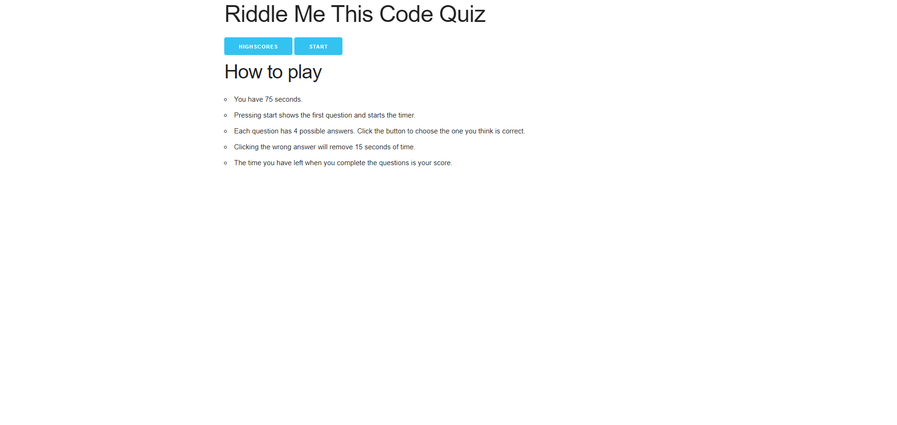
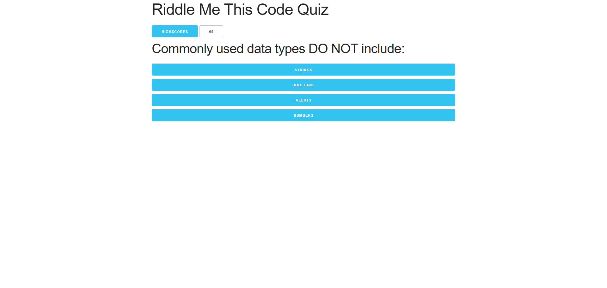
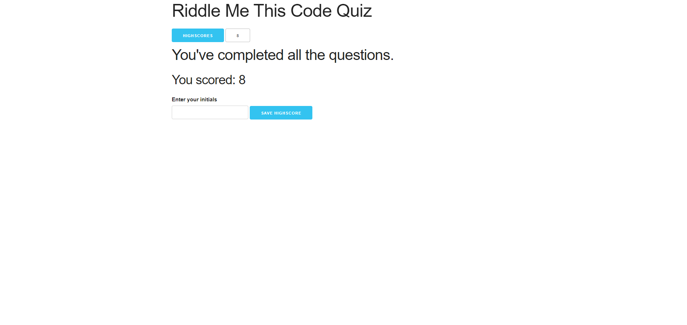
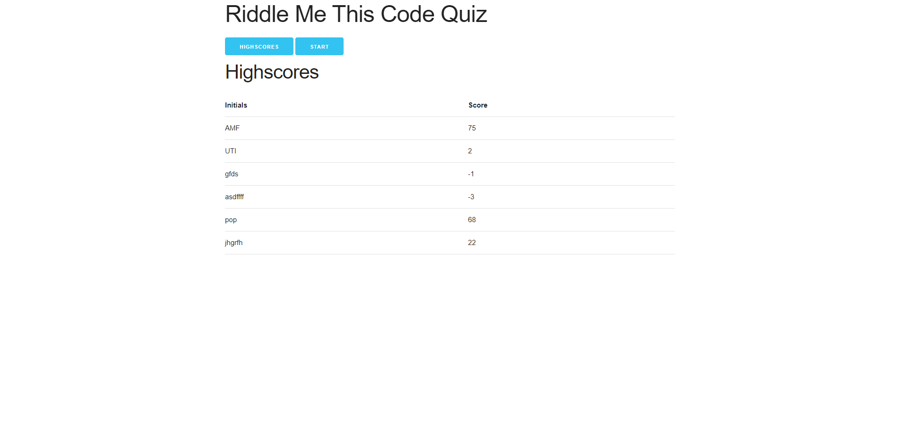

# Riddle Me This Code Quiz

## Description

A code quiz that runs in the browser and tests JavaScript knowledge.  Created to test my JS skills in the quest to become a Coding Bootcamp Graduate.  Practicing coding assessments will be useful for the job search after  graduation too!

## Installation

Visit the deployed project at [https://poisoned-eden.github.io/riddle-me-this-code-quiz/](https://poisoned-eden.github.io/riddle-me-this-code-quiz/)

## Usage

- You have 75 seconds.
- Pressing start shows the first question and starts the timer. 
- Each question has 4 possible answers.  Click the button to choose the one you think is correct. 
- Clicking the wrong answer will remove 15 seconds of time.
- The time you have left when you complete the questions is your score.

## Licence

## Credits

Thanks go to EdX Coding Bootcamp for the questions.

## Badges

___
This README was generated by [writeme-readme](https://github.com/poisoned-eden/writeme-readme)